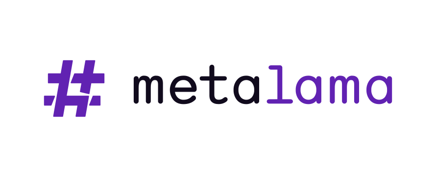

<p align="center">
  
</p>

**Metalama is a Roslyn-based meta-programming framework for code generation, architecture validation, and aspect-oriented programming in C#.**

It lets you write cleaner, more maintainable .NET code by automating repetitive patterns at compile time using aspects, templates, and compile-time logic. It integrates tightly with the Roslyn compiler, providing full control over how your code is built.

## Why Metalama?

- **Write and maintain less code**: Eliminate boilerplate by generating it dynamically during compilation, reducing code lines and bugs by up to 15%.
- **Validate your codebase in real time**: Enforce adherence to design rules and conventions without waiting for code reviews.
- **Excel with large, complex, or legacy codebases**: Metalama shines at scale and does not require architectural changes.

## When to use it?

Metalama is ideal for:

- **Large projects**: Automate repetitive patterns across dozens of entities and hundreds of properties or methods.
- **Large teams**: Align developers on consistent patterns and practices.
- **Long lifecycle projects**: Maintain quality over years of development.

It's main use cases are:

- **Design Patterns**: [Singleton](https://metalama.net/applications/classic-singleton), [Memento](https://metalama.net/applications/memento), [Factory](https://metalama.net/applications/factory), [Builder](https://metalama.net/applications/builder), [Decorator](https://metalama.net/applications/decorator), [Proxy](https://metalama.net/applications/proxy), ...
- **UI Patterns**: [INotifyPropertyChanged](https://metalama.net/applications/inotifypropertychanged), [Change Tracking](https://metalama.net/applications/command), [Memoization](https://metalama.net/applications/memoization), [Undo/Redo](https://metalama.net/applications/undo-redo), [Command](https://metalama.net/applications/command), [Dependency Properties](https://metalama.net/applications/dependency-property), ...
- **Object Services**: Cloning, ToString, Comparison, ...
- **Defensive Programming**: [Code Contracts](https://metalama.net/applications/contracts) (preconditions, post-conditions, invariants)
- **DevOps**: [Logging & Tracing](https://metalama.net/applications/logging), [Metrics](https://metalama.net/applications/metrics), [Caching](https://metalama.net/applications/caching), [Exception Handling](https://metalama.net/applications/exception-handling)
- [Architecture Validation](https://metalama.net/applications/architecture-verification) 💎
- [Refactoring](https://metalama.net/applications/refactoring)
- In general, [Clean Code](https://metalama.net/applications/clean-code) and [SOLID & DRY Principles](https://metalama.net/applications/solid)


## License

Metalama is released under the [MIT license](LICENSE.md).

Some optional extensions and IDE tooling are released under a proprietary license. 💎

## Features

- [Code Generation](https://metalama.net/features/code-generation)
- [Code Validation](https://metalama.net/features/code-validation)
- [Immediate Editor Feedback](https://metalama.net/features/architecture-verification)
- [Code Fix Toolkit](https://metalama.net/features/code-fixes) 💎
- [Ready-to-Use Aspect Libraries](https://metalama.net/features/aspect-libraries)
- [Visual Studio Tooling](https://metalama.net/features/tooling) 💎
- [Test Frameworks](https://metalama.net/features/testing)
- [Debugging of Transformed Code](https://metalama.net/features/debugging)
- [Roslyn Extensibility SDK](https://metalama.net/features/roslyn)
- [Code Query API](https://metalama.net/features/code-query)

## Resources

- 🌐 [Metalama Website](https://metalama.net)
- 📖 [Documentation](https://doc.metalama.net)
- 📝 [Annotated Examples](https://doc.metalama.net/examples)
- 📜 [Changelogs](https://github.com/orgs/metalama/discussions/categories/changelog)
- 📢 [Release Notes](https://doc.metalama.net/conceptual/release-notes)
- ✨ [Metalama Tools for Visual Studio Extension](https://marketplace.visualstudio.com/items?itemName=PostSharpTechnologies.PostSharp)

## Quick Start

1. Add the `Metalama.Framework` package to your project:

    ```powershell
    dotnet add package Metalama.Framework
    ```

2. Optionally, install [Metalama Tools for Visual Studio Extension](https://marketplace.visualstudio.com/items?itemName=PostSharpTechnologies.PostSharp). It's free for individuals, non-commercial uses, and companies with up to 3 users.

3. Explore the [Metalama Marketplace](https://metalama.net/marketplace) for ready-made aspects or examples.

4. Follow the [Getting Started](https://doc.metalama.net/conceptual/getting-started) guide to create your first aspect.

## Contributing

We welcome contributions! Here's how you can help:

- ⭐ Star the [Metalama](https://github.com/metalama/Metalama) repository or review us on [Visual Studio Marketplace](https://marketplace.visualstudio.com/items?itemName=PostSharpTechnologies.PostSharp).
- 📝 Write a blog post or record a video about Metalama.
- 📦 Share your aspects on the [Metalama Marketplace](https://metalama.net/marketplace).
- 🛠️ Contribute to [Metalama.Community](https://github.com/metalama/Metalama.Community).
- 📚 Improve the documentation. [Learn how](https://metalama.net/contributing/contribute-docs).
- 🐛 Fix bugs or contribute code. [Learn how](https://metalama.net/contributing/contribute-code).

For more details, see [Contributing to Metalama](https://metalama.net/contributing).

## Support & Community

- Report issues on GitHub. Follow [these recommendations](https://metalama.net/contributing/file-an-issue).
- Join [GitHub discussions](https://github.com/orgs/metalama/discussions) for questions and proposals.
- Enterprise support is available. Learn more about [premium support](https://metalama.net/premium/enterprise-support). 💎


## Repositories

Here are the principal repositories that make Metalama:

| Repository                                                                 | License          | Description                                                                 |
| ------------------------------------------------------------------------- | ---------------- | --------------------------------------------------------------------------- |
| [Metalama](https://github.com/metalama/Metalama)                          | MIT              | Our main repository containing the full open-source product. |
| [Metalama.Compiler](https://github.com/metalama/Metalama.Compiler)        | MIT              | Our fork of [Roslyn](https://github.com/dotnet/roslyn) adding an extensibility API for source code transformations. |
| [PostSharp.Engineering](https://github.com/postsharp/PostSharp.Engineering) | MIT              | A custom multi-repo build and CI framework.                                 |
| [Metalama.Community](https://github.com/metalama/Metalama.Community)     | MIT              | Community-contributed aspects repository.                                   |
| [Metalama.Documentation](https://github.com/metalama/Metalama.Documentation) | MIT              | Source for documentation hosted on [Metalama Docs](https://doc.metalama.net/). |
| [Metalama.Samples](https://github.com/metalama/Metalama.Samples)          | MIT              | Illustrative samples available at [Metalama Examples](https://doc.metalama.net/examples). |
| [Metalama.Premium](https://github.com/metalama/Metalama.Premium)  💎       | Proprietary      | Extensions available to customers with a commercial license.                      |


## Packages

Below is a list of packages produced from this organization:

| Package Name                                                                                          | License | Description                                                                                           |
|-------------------------------------------------------------------------------------------------------|---------|-------------------------------------------------------------------------------------------------------|
| [Metalama.Framework](https://www.nuget.org/packages/Metalama.Framework/)                             | MIT     |  This is Metalama's main and core package. It incorporates a reference to `Metalama.Compiler`, effectively replacing the Roslyn compiler with our custom version.  |
| [Metalama.Framework.Redist](https://www.nuget.org/packages/Metalama.Framework.Redist/)                             | MIT     |  Contains the public API of the Metalama Framework, without `Metalama.Compiler`. Reference this package to produce your own packages when you don't want them to use the forked compiler.  |
| [Metalama.Compiler](https://www.nuget.org/packages/Metalama.Compiler/)                             | MIT     |  A fork of Roslyn that allows add-ins (such as `Metalama.Framework`) to perform arbitrary code transformations. |
| [Metalama.Testing.UnitTesting](https://www.nuget.org/packages/Metalama.Testing.UnitTesting/)          | MIT     |  Provides base classes and utilities for unit testing compile-time code.   |
| [Metalama.Testing.AspectTesting](https://www.nuget.org/packages/Metalama.Testing.AspectTesting/)      | MIT     |  A framework based on xUnit for testing code generation by aspects.   |
| [Metalama.Framework.Redist](https://www.nuget.org/packages/Metalama.Framework.Redist/)               | MIT     |  Similar to `Metalama.Framework`, but excludes the dependency on `Metalama.Compiler`.   |
| [Metalama.Framework.Sdk](https://www.nuget.org/packages/Metalama.Framework.Sdk/)                     | MIT     |  Facilitates the use of the Roslyn API from aspects.   |
| [Metalama.Framework.Engine](https://www.nuget.org/packages/Metalama.Framework.Engine/)               | MIT     |  This is the core implementation of `Metalama.Framework`. Direct referencing of this package is discouraged and unsupported. It's intended to be a dependency for `Metalama.Testing.AspectTesting`.    |
| [Metalama.Framework.CompileTimeContracts](https://www.nuget.org/packages/Metalama.Framework.CompileTimeContracts/) | MIT     |  Defines the public API between compiled T# templates and `Metalama.Framework.Engine`.  |
| [Metalama.Framework.Introspection](https://www.nuget.org/packages/Metalama.Framework.Introspection/) | MIT     |  Provides an API to inspect the object model that represents the compilation process of `Metalama.Framework`, such as aspect and advice instances, as well as its results.  |
| [Metalama.Framework.Workspaces](https://www.nuget.org/packages/Metalama.Framework.Workspaces/)       | MIT     |  A supplementary API to `Metalama.Framework.Introspection`, designed to facilitate the loading of Visual Studio projects and solutions. This package is also useful to inspect projects that don't use Metalama. It is used by `Metalama.LinqPad`.   |
| [Metalama.Tool](https://www.nuget.org/packages/Metalama.Tool/)                                       | MIT     |  The `metalama` tool for the .NET CLI.   |
| [Metalama.Extensions.DependencyInjection](https://www.nuget.org/packages/Metalama.Extensions.DependencyInjection/) | MIT     | A framework that allows aspects to consume dependencies from an arbitrary dependency injection framework. |
| [Metalama.Extensions.Metrics](https://www.nuget.org/packages/Metalama.Extensions.Metrics/)           | MIT     | Implements code metrics that can be consumed by aspects and fabrics. |
| [Metalama.Extensions.Multicast](https://www.nuget.org/packages/Metalama.Extensions.Multicast/)       | MIT     | Simulates the legacy PostSharp attribute multicasting to ease the migration from PostSharp to Metalama. |
| [Metalama.Patterns.Caching](https://www.nuget.org/packages/Metalama.Patterns.Caching/)               | MIT     | Comprehensive caching framework for Metalama.                                                         |
| [Metalama.Patterns.Caching.Aspects](https://www.nuget.org/packages/Metalama.Patterns.Caching.Aspects/) | MIT     | Aspects designed for Metalama caching, building upon `Metalama.Patterns.Caching`.                     |
| [Metalama.Patterns.Caching.Backend](https://www.nuget.org/packages/Metalama.Patterns.Caching.Backend/) | MIT     | Provides an abstraction over caching backends, including an in-memory caching implementation.         |
| [Metalama.Patterns.Contracts](https://www.nuget.org/packages/Metalama.Patterns.Contracts/)           | MIT     | Code contract aspects like `[NotNull]`, `[Url]` for contract-based programming.                       |
| [Metalama.Patterns.Immutability](https://www.nuget.org/packages/Metalama.Patterns.Immutability/)     | MIT     | Represents the concept of Immutable Type so that it can be used by other packages like Metalama.Patterns.Observability. |
| [Metalama.Patterns.Memoization](https://www.nuget.org/packages/Metalama.Patterns.Memoization)         | MIT     | Implements a memoization aspect, i.e. simple and super-fast caching.                                  |
| [Metalama.Patterns.Observability](https://www.nuget.org/packages/Metalama.Patterns.Observability)     | MIT     | A Metalama aspect implementing `INotifyPropertyChanged`.                                              |
| [Metalama.Patterns.Wpf](https://www.nuget.org/packages/Metalama.Patterns.Wpf)                         | MIT     | Aspects that implement WPF dependency properties and commands.                                        |
| [Metalama.LinqPad](https://www.nuget.org/packages/Metalama.LinqPad/)                                 | MIT     | Provides integration with LINQPad for inspecting projects and solutions.                              |
| [Flashtrace](https://www.nuget.org/packages/Flashtrace)                                               | MIT     | A structured tracing library used by `Metalama.Patterns.Caching`.                                     |
| [Flashtrace.Formatters](https://www.nuget.org/packages/Flashtrace.Formatters)                         | MIT     | Object formatters used in caching and logging.                                                        |
| [Metalama.Licensing](https://www.nuget.org/packages/Metalama.Licensing) 💎 | Proprietary |  This package verifies that the user or the project has a valid license for Metalama. |
| [Metalama.Extensions.CodeFixes](https://www.nuget.org/packages/Metalama.Extensions.CodeFixes)  💎 | Proprietary | Enables aspects and fabrics to suggest custom code fixes. |
| [Metalama.Extensions.Validation](https://www.nuget.org/packages/Metalama.Extensions.Validation) 💎 | Proprietary | Provides a base API for aspects and fabrics to validate source code, including the validation of code references and dependencies. |
| [Metalama.Extensions.Architecture](https://www.nuget.org/packages/Metalama.Extensions.Architecture) 💎 | Proprietary | Extends the  `Metalama.Extensions.Validation` package with a high-level API to validate source code against architecture rules. |
| [Metalama.Patterns.Caching.Backends.Redis](https://www.nuget.org/packages/Metalama.Patterns.Caching.Backends.Redis) 💎 | Proprietary | Implements a `Metalama.Patterns.Caching` adapter for Redis, allowing for distributed caching and hybrid caching. |
| [Metalama.Patterns.Caching.Backends.Azure](https://www.nuget.org/packages/Metalama.Patterns.Caching.Backends.Azure) 💎 | Proprietary | Implements cache synchronization for `Metalama.Patterns.Caching` using Azure Message Bus, allowing to several several local caches in a multi-node deployment. |

